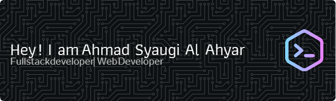

<!-- 

  

 -->

###

  
  
  

###

<h1 align="center">Hey guys, wellcome my profile</h1>

###

<h3 align="left">👩‍💻  About Me</h3>

###

Hello! My name is Ahmad Syaugi Al Ahyar. I graduated with a degree in Information Systems. I am interested in technology and the ever-evolving field of information systems, and I would like to apply my knowledge and skills in this industry.  Looking forward to connecting with like-minded individuals and exploring new opportunities!

###

<h3 align="left">🛠 Language and tools</h3>

###

  
  
  
  
  
  
  
  
  

###
